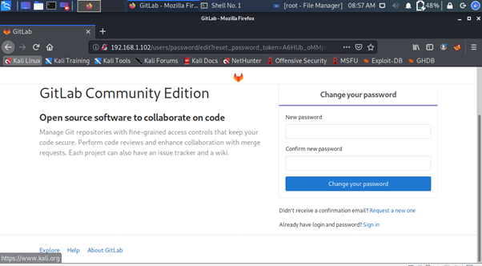
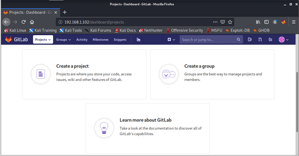
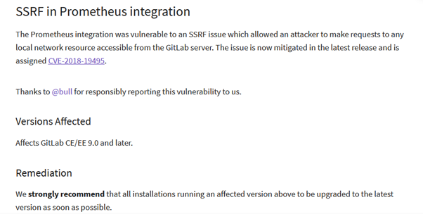

# bugbase_gitlab-task

Opened gitlab locally

&nbsp

Successfully registered

&nbsp

Found a vulnerability

&nbsp

Found the exploit here [https://github.com/mohinparamasivam/GitLab-11.4.7-Authenticated-Remote-Code-Execution](https://github.com/mohinparamasivam/GitLab-11.4.7-Authenticated-Remote-Code-Execution)

&nbsp

* ps-was only able to do till here after that got stuck.
