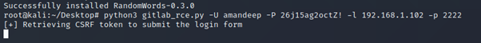

# bugbase_gitlab-task

Opened gitlab locally

Successfully registered

Found a vulnerability

Found the exploit here [https://github.com/mohinparamasivam/GitLab-11.4.7-Authenticated-Remote-Code-Execution](https://github.com/mohinparamasivam/GitLab-11.4.7-Authenticated-Remote-Code-Execution)

*was only able to do till here after that got stuck.
